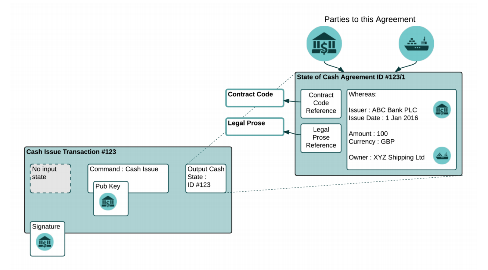
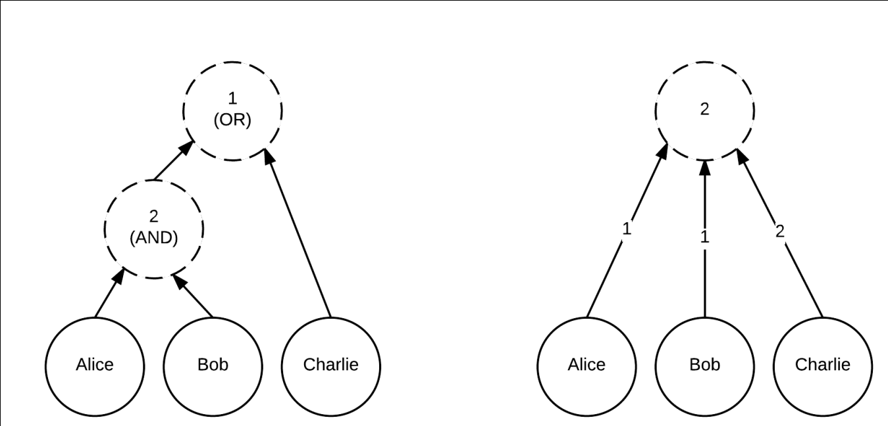
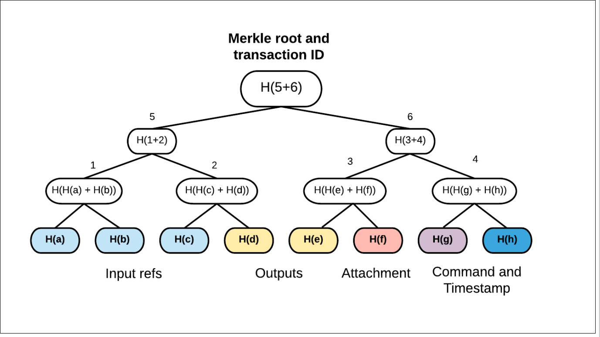
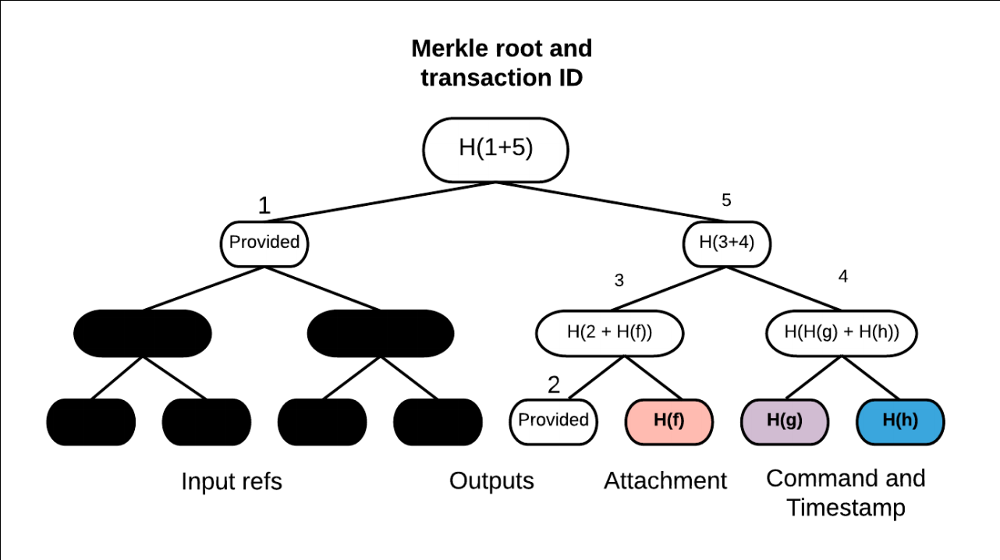
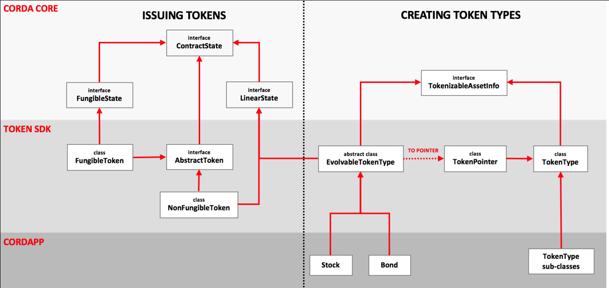

# corda

## 介绍
为什么不用 shared relational database 共享的关系数据库?
去中心化数据库 vs 分布式数据库
corda 是一个去中心化数据库平台：
* 节点是在一个认证的p2p网络，直接通信，不使用 gossip
* 可以用 JVM 字节码定义新的交易类型
* 交易可以在不同节点并行执行
* 没有区块组成的链，不使用特定的共识算法，由可插拔的 notaries 来去除交易的冲突
* 没有所有交易的广播
* flow？
* 状态，数据的原子单元
* SGX

## 概述

CorDapps

计算模型
* 虚拟计算机模型（账户模型）：全局计算机单线程执行
* UTXO：Unspent Transaction Output

可以包含任意的数据

notary: 保证签名的交易的所有输入状态是未消费的
一个交易不允许消费被多个 notary 控制的状态，因此，不需要在 notary 之间进行两阶段提交。

## p2p

* 节点： 机构运营，使用 amqp 协议通信，tls
* 认证服务： x.509 证书授权
* network map 服务： 如何去连网络里的节点
* 一个或多个 notary 服务
* 零个多个 oracle 服务： 为声明的正确的 fact 提供签名

### identity root

参加 corda 的网络需要身份证书
支持假名

### network map

* 监听的地址列表
* 协议版本号
* 持有的身份证书

文件列表缓存并分布在基于http基本的文件传输网络

### 消息传输

消息会被写入磁盘，会一直重试直到对端节点已经确认一个消息

使用 Apache artemis message broker

### 序列化

使用 amqp 二进制格式
每个消息都有一个 uuid

### 网络参数

### 协议版本

递增的整数版本号

### business networks

## flow framework

### 概述

Corda 网络使用点对点的消息传输而不是全局广播。

协调一个关于账本的更新需要网络上的参与者明确的指定需要发送什么信息，发送给谁，按照什么顺序发送。

#### JIT 状态机编译器

#### 透明的 checkpointing

flow可以根据需要暂停和重启，一次激活的 flow 比内存中的 flow 多是可行的。

#### identity 到 IP 的映射

flows 是依据 identity 来写的,
框架关心把一个给定的 identity 路由到正确的 ip 地址上

#### subflows 库

flows 可以调用 sub-flows

#### 进度报告

flows 可以提供一个进度跟踪器， 指示 flows 要执行的步骤

#### flow hospital

flows 可以暂停，如果出现异常的情况或者明确要求认为协助。
一个已停止的 flow 会出现在 flow hospital，节点的管理员可以决定 kill 掉或者提供一个解决方案。

### 数据可见性和依赖关系解析

ResolveTransactions flow: 检查交易有效性

一个交易是无效的只要它传递的依赖关系中有任何是无效的

交易总是在 flow 中通信， flow 嵌入 resolution flow ，从正确的 peer 自动获取和检查必要的依赖项。

#### 小范围交易
#### 交易隐私技术

交易数据隐藏

#### 状态再发行

## identity
## 数据模型

### 交易结构

交易包含：

* consuming input reference
* output states
* non-consuming input references
* attachments: 文件哈希
* commands: 定义交易作用
* signatures
* type: normal, notary-changing, explicit upgrades.
* timestamp
* network parameters

### composite keys

### time handling

timestamps 指定一个交易被断言在 [start, end] 的时间窗口产生

#### reference clocks
#### timezones

### attachments 和 合约字节码

一个合约是一个实现了 Contract 接口的类，实现了一个单一的函数 verify，这个函数会传入一个交易，如果交易无效就会抛出一个异常，有效则不返回。

#### data files
#### signing

### 合约约束条件

### precise naming
#### 不可重叠规则
#### 包命名空间所有权

### 争议解决

### oracle 及 tear-offs

### 产权负担

### event scheduling

为了请求 计划的事件，一个状态可以实现 SchedulableState 接口 并从nextScheduledActivity 函数中返回一个请求。

### Tokens

一个抽象的可计数对象，非常是和代表价值

#### token sdk

## notaries 及共识

### 和 nakamoto 区块链比较
### 算法灵活性
### 生效和不生效的 notaries

* validating notaries: 解决并完全检查交易
* non-validating notaries: 假设交易有效并且不会消费的 state 里表之外的交易或依赖

## 节点

一个节点表现为一个装载了 JARs 的应用服务器，包含了 CorDapps 并为他们提供p2p网络的访问，签名密钥，一个用来任何目的的关系型数据库，一个存储 state 的 vault

### the vault

钱包

### 直接 sql 访问

### client RPC and reactive collections

## 确定性的 JVM

## 可扩展性

### 局部可见

### 多 notaries
### 并行处理
### chain snipping
### 签名有效性
### 即时编译

## 隐私

* 部分数据可见
* 交易 tear-offs
* 随机密钥
* Graph pruning.
* Global ledger encryption.
