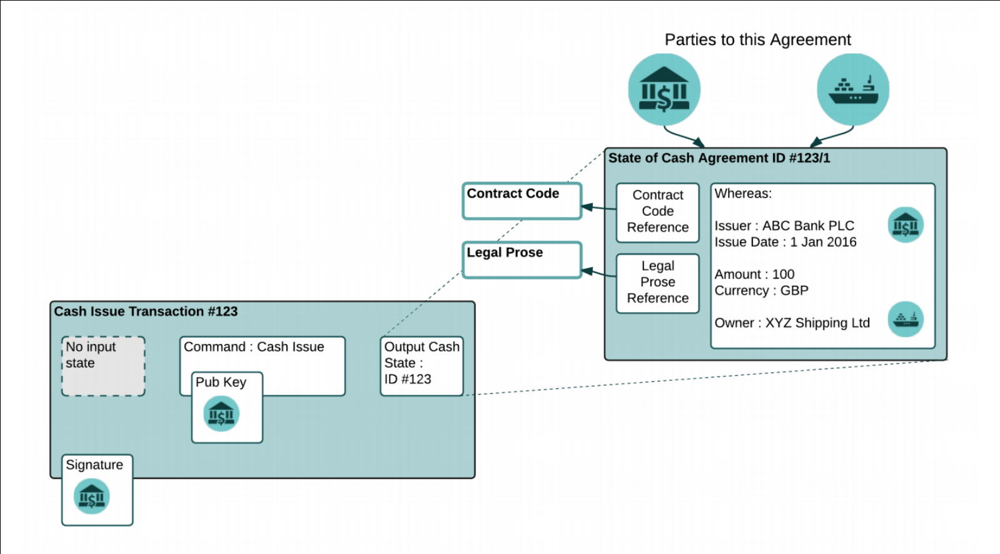
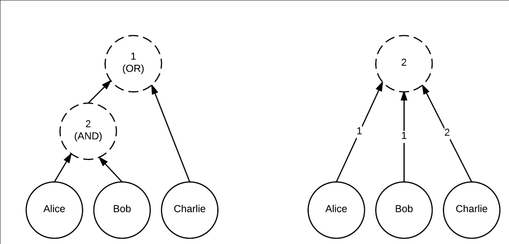
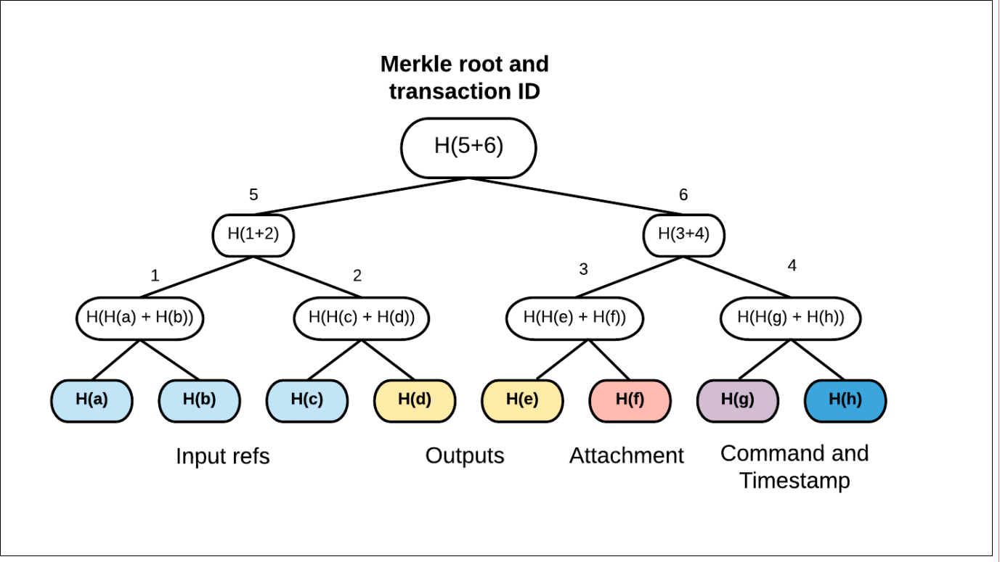

# corda tech whitepaper

## introduction

why not shared relational database?
decentralised database vs distributed database?

corda is a dccentralised database platform:
* nodes are arranged in an authenticated p2p network, all communication is direct, gossip is not used.
* new transaction types can be defined using JVM bytecode.
* txs may execute in parallel, on different nodes
* no block chain. txs races are deconflicted using pluggable notaries. no particular consensus algorithm
* data is shared on a need-to-know basis. no global broadcast of all txs.
* flows?
* states, atomic unit of data
* SGX

## overview

CorDapps

the model of computation:
* virtual computer model: the in-memory state of a global computer with a single thread of execution.
* UTXO: a set of immutable rows keyed by (hash: output index)

corda database rows can contain arbitrary data, not just a value field.

notary: guarantees it will sign a tx only if all the input states are un-consumed.
a transaction is not allowed to consume states controlled by multiple notaries and thus there is never any need fo two-phase commit between notaries.

## p2p network

* nodes: operated by parties, communicating using amqp over tls.
* an identity service: x.509 certificate authority.
* a network map service: how to connect to nodes on the network.
* one/more  notary services. a notary may be decentralised over a coalition of different parties.
* zero/more oracle: signs txs if they state a fact and fact is considered to be true.

### identity root

takging part in a corda network as a node requires an identity certificate.
entired pseudonymous corda network

### network map

* the set of IP addresses it listens on
* the version of the protocol
* which identity

the map is a set of files that may be cached and distributed vis http based content delivery networks.

### message dilivery

message are written to disk and delivery is retried until the remote node has acknowledged a message.
Apache artemis message broker.

### serialization

amqp binary format.
each mesasge has a uuid.

### network parametes

### protocol versioning

incrementing integer version number

### business networks

## flow framework

### overview

all communication  takes the form of small multi-party sub-protocols called flows.

#### JIT state machine compiler

#### transparent checkpointing

flows are resumed and suspended on demand, meaning it is feasible to have far more flows active at once than would fit in memory.

#### identity to ip address mapping

flows are written in terms of identity.
the framework takes care of routing messages to the right ip address for a given identity.

#### a library of subflows

flows can invoke sub-flows.

#### process reporting

flows can provide a progess tracker that indicates which step they are up to.

#### flow hospital

flows can parse if they throw exceptions or explicitly request human assistance.
a flow that has stopped appears in the flow hospital where the node administrator may decide to kill the flow or provide it with a solution.

### data visibility and dependency resolution

ResolveTransactions flow: check the tx validity

a tx is not considered valid if any of its transitive dependencies are invalid.

txs are always communicated inside a flow, and flows embed the resolution flow, the necessary dependencies are fetched and checked automatically from the correct peer.

#### small-subgraph txs

#### tx privacy technique

tx data hiding

#### state re-issuance

## identity
## data model

### tx structure

txs consist of the following components:

* consuming input reference
* output states
* non-consuming input references
* attachments: file hashes.
* commands: define what a tx does
* signatures
* type: normal, notary-changing, explicit upgrades.
* timestamp
* network parameters

### composite key 

### time handling

tx timestamps specify a [start, end] time window within which the tx is asserted to have occurred.

#### reference clocks
#### timezones

### attachments and contract bytecodes

A contract is simply a class that implements the Contract interface, which in turn exposes a single function called verify. The verify function is passed a transaction and either throws an exception if the transaction is considered to be invalid, or returns with no result if the transaction is valid

#### data files
#### signing

### contract constraints

### precise naming
#### no overlap rule
#### package namespace ownership

### dispute resolution

### oracle and tear-offs

### encumbrances
### event scheduling

To request scheduled events, a state may implement the SchedulableState interface and then return a request from the nextScheduledActivity function.

### Tokens

abstract countable objects highly suited to representing value

#### token sdk

## notaries and consensus

### comparison to nakamoto block chain
### algorithmic agility
### validating and non-validating notaries

* validating notaries: resolve and fully check transactions they are asked to de conflict.
* non-validating notaries: assume transaction validity and do not request transaction data or their dependencies beyond the list of states consumed.

## node

the node acts as an application server which loads JARs containing CorDapps and provides them with access to the peer-to-peer network, signing keys, a relational database that may be used for any purpose, and a ‘vault’ that stores states.

### the vault

wallet

### direct sql access

### client RPC and reactive collections

## deterministic JVM

## scalability

### partial visibility
### multiple notaries
### parallel processing
### chain snipping
### signatures of validity
### JIT compilation

## privacy

* Partial data visibility
* Transaction tear-offs
* Key randomisation
* Graph pruning.
* Global ledger encryption.
