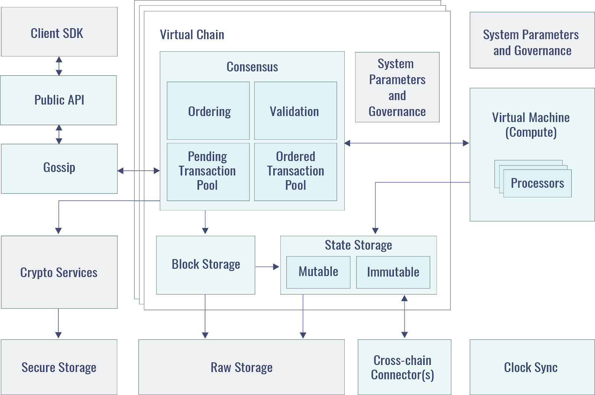

# orbs

position paper. no technology detail.

## Architecture

## Complementary Infrastructure

> Orbs utilizes blockchain virtualization to optimize traffic for decentralized apps, a form of
> intelligent sharding that is more efficient (as a first level of sharding) than other sharding
> methods.

### Sharding via Blockchain Virtualization

> Blockchain virtualization constitutes an intelligent
> form of sharding, as opposed to the random sharding proposed for other systems.
> Decentralized consensus is an unavoidable bottleneck, but the Orbs platform decouples
> tenants to different shards allowing the network to scale out horizontally as new tenant apps
> are added. It does this by isolating each dApp on Orbs onto its own virtual chain, segmenting
> end-users logically according to their likelihood to interact (in this case, those using the same
> dApp).
>
> Permissioned consensus models, especially when
> employing consensus committees via RPoS, do not weaken its security properties when
> sharded. Different decentralized apps are independent and work with different unrelated
> assets. This is particularly true if fees are paid in bulk as Orbs proposes, rather than per
> transaction. By sharding decentralized apps by default, the architecture can revolve around
> parallelization.
>
> The Orbs infrastructure is designed to support a large number of independent dApps running
> on top of it. While applications are independent from one another by design, when running on
> top of this shared infrastructure they enjoy the benefits of sharing resources, but still allow the
> system to scale out thanks to the natural sharding of virtual chains.
> Unlike other forms of sharding in development, Orbs segments traffic by those most likely to interact with each
> other – users on the same dApps.

## Polyglot Cross-Chain Contracts

> These smart contracts running on top of Orbs can read data from other
> blockchains in a secure and trusted way
> Just like a smart contract can read variables from
> the secure on-chain Orbs storage, the smart contract can also read a variable from Ethereum.

## Autonomous Swap

None

## Helix

Skip

## SLA

> A Service Level Agreement (SLA) is a contract that describes the official commitment between
> a service provider and a client. It describes the expected level of service, the metrics used to
> measure it and the penalties in case the agreed service level is not achieved.
